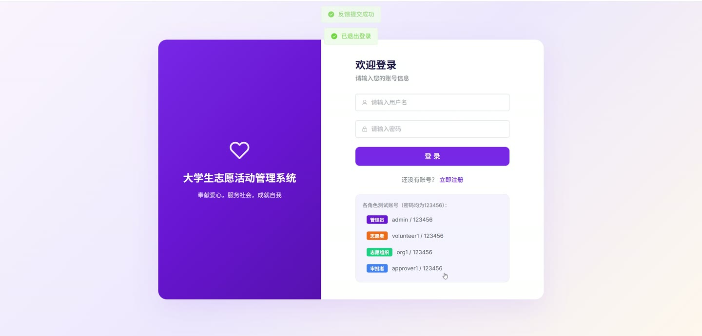
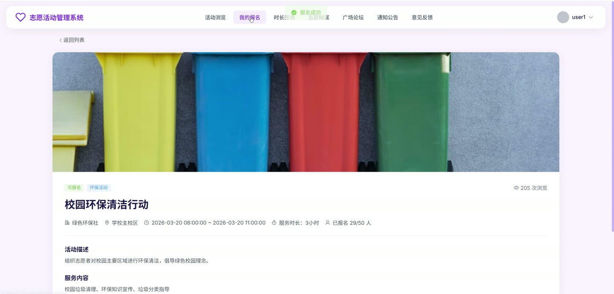
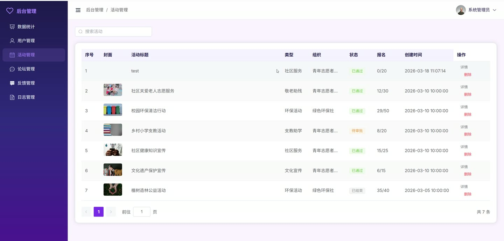
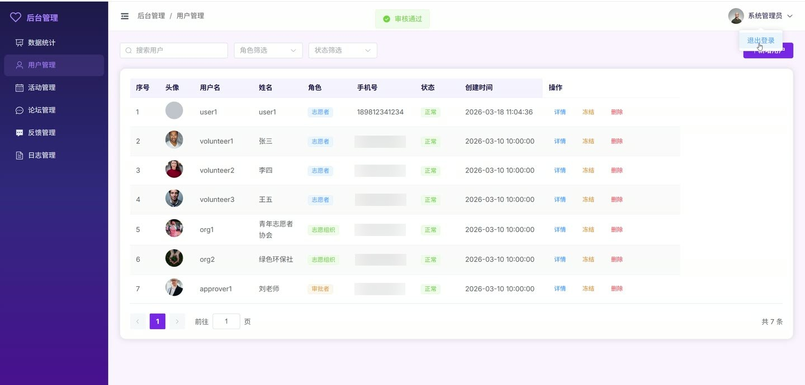
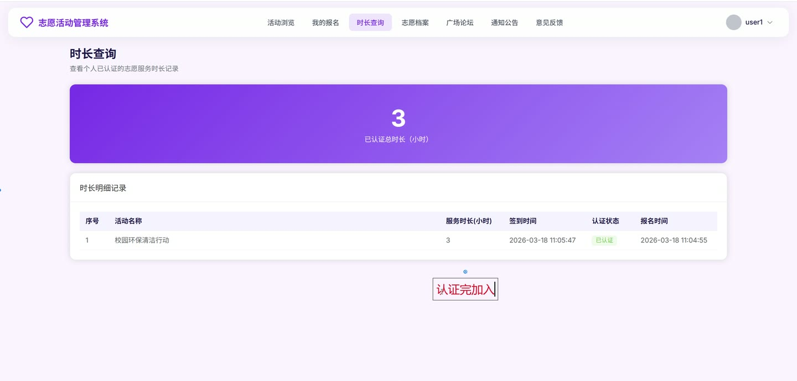

# (附文档)Springboot3+Vue3+MySQL 大学生志愿活动管理系统

**技术栈**：Springboot3、Vue3、MySQL

### 系统简介

本系统是一个基于 Spring Boot 3 + Vue 3 + MySQL 构建的大学生志愿活动管理平台，采用前后端分离架构。系统支持普通用户、志愿组织、学校审批者、管理员四种角色，提供活动发布与审批、报名签到、服务时长认证、论坛交流、公告管理、反馈处理等完整功能，实现志愿活动全流程数字化管理。
 
### 核心功能
 
### 普通用户端

 
- 浏览活动列表（支持按关键词、活动类型、活动状态进行筛选与分页查询） 
- 查看活动详情（自动增加浏览量计数，展示活动地点、最大人数、当前报名人数等信息） 
- 报名参加活动（检查是否已报名、活动状态是否为已审批、报名人数是否已满，报名后更新活动当前人数） 
- 取消报名（取消后自动减少活动当前报名人数） 
- 查看我的报名记录（分页展示已报名活动，包含活动标题与报名时间） 
- 查看已认证总服务时长（获取志愿者所有已认证的累计服务时长） 
- 查看时长记录（展示所有已认证的时长记录，包含活动名称与时长） 
- 发布论坛帖子（填写标题与内容，发布后自动记录浏览量、评论数） 
- 浏览论坛帖子列表（支持关键词搜索） 
- 查看帖子详情（自动增加浏览量，展示帖子内容与用户信息） 
- 发表评论（在帖子下发表评论，自动更新帖子评论数） 
- 查看帖子评论列表（按时间升序展示，显示评论者姓名与头像） 
- 提交反馈（填写反馈内容，状态默认为待处理） 
- 查看通知公告列表（支持关键词搜索） 
- 查看公告详情 
- 查看个人信息（获取当前登录用户信息，隐藏密码） 
- 更新个人信息（修改姓名、电话、头像等，不可修改密码与角色） 
- 用户注册（填写用户名、密码、角色等，注册后状态为待审核） 
- 用户登录（验证用户名与密码，校验账号状态，生成 JWT Token）
 
### 管理员端

 
- 分页查询用户列表（支持按关键词、角色、状态筛选，不显示管理员角色） 
- 审核用户注册（通过或拒绝，拒绝时可填写拒绝理由） 
- 冻结/解冻用户（切换用户状态，不可操作管理员账号） 
- 新增用户（管理员直接添加用户，状态默认为正常） 
- 删除用户 
- 查看活动统计数据（活动总数、进行中活动数、已结束活动数、待审批活动数、参与总人数、总服务时长） 
- 查看用户统计数据（志愿者总数、组织总数、用户总数） 
- 分页查询操作日志（支持按模块、用户名、操作关键词搜索） 
- 删除单条操作日志 
- 批量删除操作日志 
- 分页查询用户反馈（支持按状态筛选） 
- 回复用户反馈（填写回复内容，状态更新为已解决） 
- 发布通知公告（填写标题与内容） 
- 编辑通知公告 
- 删除通知公告 
- 删除论坛帖子 
- 审批活动（通过或驳回，填写审批意见） 
- 审批活动经费（通过或驳回，填写审批意见） 
- 认证志愿者服务时长（查看待认证时长列表，通过或驳回）
 
### 志愿组织端

 
- 发布新活动（填写标题、地点、类型、最大人数、经费等信息，状态默认为待审批，经费状态默认为待审批） 
- 编辑已发布的活动 
- 删除已发布的活动 
- 查看本组织发布的活动列表（分页展示，支持关键词搜索） 
- 查看活动的报名列表（分页展示报名志愿者，显示志愿者姓名、学号） 
- 对报名志愿者进行签到（记录签到时间） 
- 提交志愿者服务时长（为已签到的志愿者录入服务小时数） 
- 批量提交时长认证（选择多条记录提交认证申请）
 
### 技术栈

 后端框架Spring Boot 3.x ORM 框架MyBatis-Plus 权限认证JWT (jjwt) 密码加密Hutool MD5 前端框架Vue 3 构建工具Maven 数据库MySQL
 
### 交付内容

 
- 后端完整源码 
- 前端完整源码 
- 数据库初始化脚本 
- 万字文档

## 界面展示

---

## 获取完整源码 + 万字文档

本仓库为项目介绍页。**完整前后端源码、数据库初始化脚本、万字项目文档**，请加微信 `kangkangcode`，或访问 [codekk.top](http://codekk.top) 获取。

可作课程设计 / 毕业设计参考，支持远程部署调试。